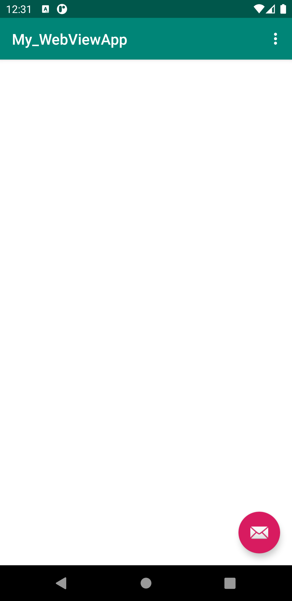

# Rapport Webview

I denna rapport beskrivs en uppgift i Webview. Uppgiften innehöll flera olika steg som alla skulle leda till att en intern webbsida samt en extern webbsida kunde visas i applikationen.

För att detta skulle kunna genomföras behövde först applikationen ges tillgång till internet, detta gjordes med denna kod i AndroidManifest.xml:

    <uses-permission android:name="android.permission.INTERNET" />

Sedan behövde ett WebView-element skapas i content_main.xml, detta element skulle ges id my_webview. Koden för detta blev då:

    <WebView
        android:id="@+id/my_webview"
        android:layout_width="match_parent"
        android:layout_height="match_parent"
    />

Vidare skulle en privat medlemsvariabel med namnet myWebView av typen Webview. Efter detta skulle tidigare skapat WebView-element lokaliseras med hjälp av dess id. Även en WebViewClient skulle skapas och denna skulle sedan ges möjlighet att köra JavaScript. Koden blev följande:

    private WebView myWebView;

kodsnutt ovanför resulterar i en privat medlemsvariabel av typen WebView med namnet myWebView.

    myWebView = findViewById(R.id.my_webview);
    myWebView.getSettings().setJavaScriptEnabled(true);
Kodsnutten ovan lokaliserar Webview-elementet i content_main.xml och ger sedan möjlighet till körning av Javascript. Lokaliseringen av Webview-element gör att en WebViewClient inte behöver skapas.

Till sist skulle kod för att ladda url läggas till i metoderna "showExternalWebPage()" and "showInternalWebPage()". Dessa metoder skulle sedan kallas på när de valdes i en meny i aplikationen.

    public void showExternalWebPage(){
        myWebView.loadUrl("https://www.his.se/");

    }

    public void showInternalWebPage(){
        myWebView.loadUrl("file:///android_asset/about.html");

    }

Ovan syns kod för att ladda url i de olika metoderna.

    @Override
    public boolean onOptionsItemSelected(MenuItem item) {
        int id = item.getItemId();

        if (id == R.id.action_external_web) {
            showExternalWebPage();
            Log.d("==>","Will display external web page");
            return true;
        }

        if (id == R.id.action_internal_web) {
            showInternalWebPage();
            Log.d("==>","Will display internal web page");
            return true;
        }
    }
Koden ovan kallar på metoderna när de väljs i en meny i aplikationen.

Efter att allt detta var genomfört var uppgiften färdigställd, följande resultat syns i emulatorn:

Screenshot på extern webbsida.

Screenshot på intern webbsida.

